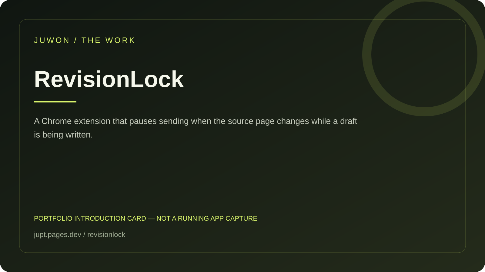

<!-- JUWON-PORTFOLIO-INTRO:START -->
# RevisionLock



*Portfolio introduction card, not a screenshot of a running application.*

*포트폴리오 소개 카드입니다. 실행 화면 캡처가 아닙니다.*

## English

A Chrome extension that pauses sending when the source page changes while a draft is being written.

[View JUWON's portfolio](https://jupt.pages.dev/) · [Browse the project collection](https://jupt.pages.dev/projects)

**Scope:** This README presents the repository's documented intent and recorded visual evidence. It does not certify that every feature is complete, deployed, or currently working. Follow the original setup, safety, and license documentation below.

## 한국어

초안을 작성하는 동안 페이지가 바뀌었을 때 전송을 잠시 멈추는 확장.

[JUWON 포트폴리오 보기](https://jupt.pages.dev/) · [전체 프로젝트 보기](https://jupt.pages.dev/projects)

**확인 범위:** 저장소의 문서상 목적과 기록된 화면 근거를 소개합니다. 모든 기능의 완성·배포·현재 정상 작동을 보증하지 않습니다. 설치법·안전 주의사항·라이선스는 아래 기존 문서를 확인하세요.
<!-- JUWON-PORTFOLIO-INTRO:END -->

---

## Original documentation / 기존 문서

# RevisionLock 🧭

**A browser message should not leave while the page underneath it is stale.**

RevisionLock is a small, local-first Chrome extension that pauses a message when the page changes underneath your draft or when the tab returns from the background. It gives you a visible choice: refresh, keep editing, or send once anyway.

No cloud account. No AI key. No telemetry. No automatic send. Your message stays in the page.

## Why this exists

People write replies in pages that can silently change: a pull-request review can refresh, a support console can update, and a long browser conversation can become stale on another device. The send button still looks normal, so the dangerous action is easy to miss.

The problem is documented in [GitHub Community discussion #68448](https://github.com/orgs/community/discussions/68448), [Codex issue #48490](https://github.com/openai/codex/issues/48490), and [Codex issue #42269](https://github.com/openai/codex/issues/42269). RevisionLock turns that silent state change into a deliberate decision at the last safe moment.

## Try it in 60 seconds

```powershell
npm ci
npm run demo
```

Open <http://127.0.0.1:4174>.

1. Click in the reply box or leave the sample draft in place.
2. Click **Simulate page update**.
3. Click **Send reply**.
4. RevisionLock pauses the send and shows the reason.
5. Choose **Refresh page**, **Keep editing**, or **Send anyway once**.

## Install locally in Chrome

```powershell
npm ci
npm run build
```

1. Open `chrome://extensions`.
2. Turn on **Developer mode**.
3. Choose **Load unpacked** and select this repository's `dist/` folder.
4. Open a page with a text box, click the RevisionLock extension, and choose **Enable on this tab**.

The extension is opt-in per tab. It uses `activeTab` and `scripting` only to install the guard into the tab you explicitly choose.

## What it guards

- Textareas, text inputs, contenteditable editors, and `role="textbox"` editors.
- Buttons labelled with common send words such as **Send**, **Submit**, **Post**, or **Reply**.
- Page DOM changes outside the active composer.
- A tab that becomes hidden and then visible again while you are drafting.

## Safety boundaries

- **No automatic send or reload.** Both are explicit button choices.
- **No network requests, accounts, cloud service, or telemetry.**
- **No clipboard history, password fields, or message archive.**
- **Ambiguous controls are left alone.** A false negative is safer than intercepting an unrelated button.
- **One-time bypass only.** “Send anyway once” approves the exact intercepted button click, then the guard is active again.

This is an MVP. Websites with custom shadow-DOM editors, virtualized controls, or non-standard send semantics may not be detected yet.

## Development

```powershell
npm test
npm run typecheck
npm run lint
npm run build
npm audit
```

The test suite starts with pure state-machine tests, then covers send-label detection. See [CONTRIBUTING.md](CONTRIBUTING.md), [SECURITY.md](SECURITY.md), and the [verification record](docs/verification/2026-10-03.md) for the release process.

## 7-day validation experiment

Give the demo and unpacked extension to ten people who write PR reviews, support replies, or long browser conversations. Ask one question after each intercepted send: **“Did this save you from checking the page manually?”** The survival metric is not clicks; it is whether people keep the extension enabled after the first day.

## License

MIT © 2026 juwonllee2024-dotcom
